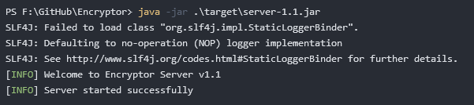
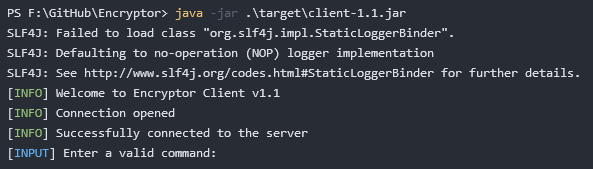

# Encryptor
## Overview
Encryptor is a secure and reliable application designed to safely store confidential information in an encrypted format. With a robust client-server architecture, Encryptor ensures that your sensitive data is protected both during transit and at rest.
## Features
- **User Authentication**: Register and log in to the system securely to access your encrypted messages.
- **Multi-User Support**: Send and receive messages to and from any other user registered on the platform.
- **Secure Storage**: Encrypt your confidential messages and store them safely on the server.
- **Advanced Encryption**: Cutting-edge encryption to ensure your data is secure.
## Getting Started
### Prerequisites
#### Common (Server & Client)
- **Java**: Java(TM) SE Runtime Environment (build 21.0.3+7-LTS-152), Java(TM) SE Runtime Environment (build 1.8.0_411-b09)
#### Server
- **PostgreSQL**: PostgreSQL 16.1

Remark: Versions of the software mentioned above were used during development and testing process, however other versions might still support it.
### Installation
#### Quickstart approach
- **Download the assets from**: https://github.com/deNeedo/Encryptor/releases/latest

Namely you are interested in these files: **server-X.Y.jar**, **client-X.Y.jar** and **setup.sql** where **X** adn **Y** represents the version indicator.
- **Provide config for database for the server**:
```bash
[Default config path: ./config/db.config]
[Contents of the file should be as below:]
db.address=[POSTGRES OPERATING IP ADDRESS]
db.port=[POSTGRES OPERATING PORT]
db.database=encryptor
db.user=[POSTGRES USER]
db.password=[POSTGRES PASSWORD]
[Replace the [...] with your personal configuration.]
```
- **Initialize database with setup script**:
```bash
psql -f ./path/to/setup.sql
```
#### Manual compilation
- **Clone the repository**
```bash
git clone https://github.com/deNeedo/Encryptor.git
```
- **Compile the project using Maven** (for development and testing process Apache Maven 3.9.6 was used)
```bash
mvn clean
mvn install -P server
mvn install -P client
```
- **Provide config for database for the server**:
```bash
[Default config path: ./config/db.config]
[Contents of the file should be as below:]
db.address=[POSTGRES OPERATING IP ADDRESS]
db.port=[POSTGRES OPERATING PORT]
db.database=encryptor
db.user=[POSTGRES USER]
db.password=[POSTGRES PASSWORD]
[Replace the [...] with your personal configuration.]
```
- **Initialize database with setup script**:
```bash
psql -f ./database/setup.sql
```
### Running the Application
- **Start the Server**
```bash
[X adn Y represents the version indicator]
java -jar ./target/server-X.Y.jar
```
- **Start the Client**
```bash
[X adn Y represents the version indicator]
java -jar ./target/client-X.Y.jar
```
### Usage
#### Server
After running the app server should initialize connection to the database and you should see something like that:


#### Client
After running the app client should initialize connection to the server and you should see something like that:



**Supported commands are**: register, login, logout, encrypt, decrypt, exit