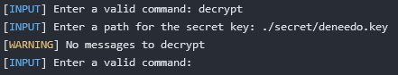

# Encryptor
## Overview
Encryptor is a secure and reliable application designed to safely store confidential information in an encrypted format. With a robust client-server architecture, Encryptor ensures that your sensitive data is protected both during transit and at rest.
## Features
- **User Authentication**: Register and log in to the system securely to access your encrypted messages.
- **Multi-User Support**: Send and receive messages to and from any other user registered on the platform.
- **Secure Storage**: Encrypt your confidential messages and store them safely on the server.
- **Advanced Encryption**: Cutting-edge encryption to ensure your data is secure.
## Getting Started
### Prerequisites
#### Common (Server & Client)
- **Java**: Java(TM) SE Runtime Environment (build 21.0.3+7-LTS-152), Java(TM) SE Runtime Environment (build 1.8.0_411-b09)
#### Server
- **PostgreSQL**: PostgreSQL 16.1

Remark: Versions of the software mentioned above were used during development and testing process, however other versions might still support it.
### Installation
#### Configuration files
- **Provide config for database**:
```bash
[Default config path: ./config/db.config]
[Contents of the file should be as below:]
db.address=[POSTGRES OPERATING IP ADDRESS]
db.port=[POSTGRES OPERATING PORT]
db.database=encryptor
db.user=[POSTGRES USER]
db.password=[POSTGRES PASSWORD]
[Replace the [...] with your personal configuration.]
```
- **Provide config for server app**:
```bash
[Default config path: ./config/server.config]
[Contents of the file should be as below:]
server.address=[SERVER OPERATING IP ADDRESS]
server.port=[SERVER OPERATING PORT]
[Replace the [...] with your personal configuration.]
```
- **Provide config for client app**:
```bash
[Default config path: ./config/client.config]
[Contents of the file should be as below:]
client.address=[CLIENT OPERATING IP ADDRESS]
client.port=[CLIENT OPERATING PORT]
[Replace the [...] with your personal configuration.]
```
#### Quickstart approach
- **Download the assets from**: https://github.com/deNeedo/Encryptor/releases/latest

Namely you are interested in these files: **server-X.Y.jar**, **client-X.Y.jar** and **setup.sql** where **X** adn **Y** represents the version indicator.
- **Initialize database with setup script**:
```bash
psql -f ./path/to/setup.sql
```
#### Manual compilation
- **Clone the repository**
```bash
git clone https://github.com/deNeedo/Encryptor.git
```
- **Compile the project using Maven** (for development and testing process Apache Maven 3.9.6 was used)
```bash
mvn clean
mvn install -P server
mvn install -P client
```
- **Initialize database with setup script**:
```bash
psql -f ./database/setup.sql
```
### Running the Application
- **Start the Server**
```bash
[X adn Y represents the version indicator]
java -jar ./target/server-X.Y.jar
```
- **Start the Client**
```bash
[X adn Y represents the version indicator]
java -jar ./target/client-X.Y.jar
```
### Usage
#### Server
After running the app server should initialize connection to the database and you should see something like that:


#### Client
After running the app client should initialize connection to the server and you should see something like that:


**Supported commands are**: register, login, logout, encrypt, decrypt, exit

##### Register command example
The correct command execution process looks like this:


When you try to register using the username that already exists in the system, you will see this log:


##### Login command example
The correct command execution process looks like this:


If you are already logged in to the system, you will see this log:


When you try to log in, using the username that does not exists in the system, you will see this log:


##### Logout command example
The correct command execution process looks like this:


When you try to log out, while not being logged in prior to that, you will see this log:


##### Exit command example
The correct command execution process looks like this:


However you can still close the app using keyboard interrupts (for instance Ctrl + C):


##### Encrypt command example
The correct command execution process looks like this:


If you try to use this command, while not being logged in, you will see this log:


If you provide a non existing path to the message you wish to encrypt, you will see this log:


If you make a mistake while providing user to whom you would like to send this message, you will see this log:


##### Decrypt command example
The correct command execution process looks like this:


However, if you have no encrypted messages waiting for you, you will see this log:



If you try to use this command, while not being logged in, you will see this log:


If you provide a non existing path to the message you wish to encrypt, you will see this log:


